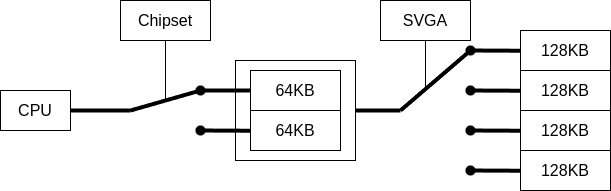

# Image Viewer for OASYS LX-7500SD
富士通製ワープロ OASYS LX-7500SDで640x480 256色の画像を表示するプログラム

## ビルド方法
16bit対応をインストールしたOpenWatcomで`wcl -bt=dos -mc main.c`としてください

## 使用方法
640x480の画像ファイルをインデックスカラー形式(256色)で用意します。

GIMPでインデックスカラーに設定してRaw 画像データとしてエクスポートすると、インデックス+アルファチャンネルでエクスポートされるので1バイトごとに削除するなどしてください

パレットデータは1バイトごとにR,G,Bの順番に並ぶ形式です

画像データを`pic.bin` パレットデータを`palette.bin`という名前で保存してください

フロッピーディスクに画像・パレットデータと実行ファイルを置いて、OASYSのMS-DOSから実行すると画像が表示されます

なお、テキストカーソルによるVRAMの上書きを防ぐためにプログラム末尾は無限ループとなっているので、終了時は電源断してください

## 解説
x86 Real Modeではセグメント+オフセット方式のアドレッシングにより連続でアクセス可能な領域が64KiBに制限されます

また、IBM VGA規格ではVRAMのメモリマップは最大で0xA0000~0xBFFFFの128KiBとなっています

一方で、640x480x8bitの画像は300KiBを必要とします

制限を突破するために、OASYSのチップセットとSVGAコントローラ(Panasonic MN89304)は、メモリウインドウをレジスタから切り替えられるようになっています
これによりCPUからは64KiBの領域からすべてのVRAM領域にアクセスすることができます

SVGAコントローラ側のメモリウインドウの変更は、Sequencer Register(IOアドレス 0x3C4)の独自拡張レジスタであるインデックス0x8番の上位4bitで行います
また、下位4bitは描画モードに関連していると思われ、1に設定することで640x480x8bitによる描画が可能になります

チップセット側のメモリウインドウの変更は、IOアドレス 0xFF0Aにより行います
これにより0xC0000~0xCFFFFの領域のメモリウインドウが変更されます
0に設定することでVRAMの前半64KBが見えるようになり、0x40に設定することで後半64KBが見えるようになります

## 備考
ビルドに関してはインラインアセンブラの記法さえ調節すればBorland C Compilerとかでもできるんじゃないでしょうか ~~知らんけど~~

また動作機種に関してもLX-6500SDとかLX-9500SDとかでも動くんじゃないでしょうか ~~知らんけど~~